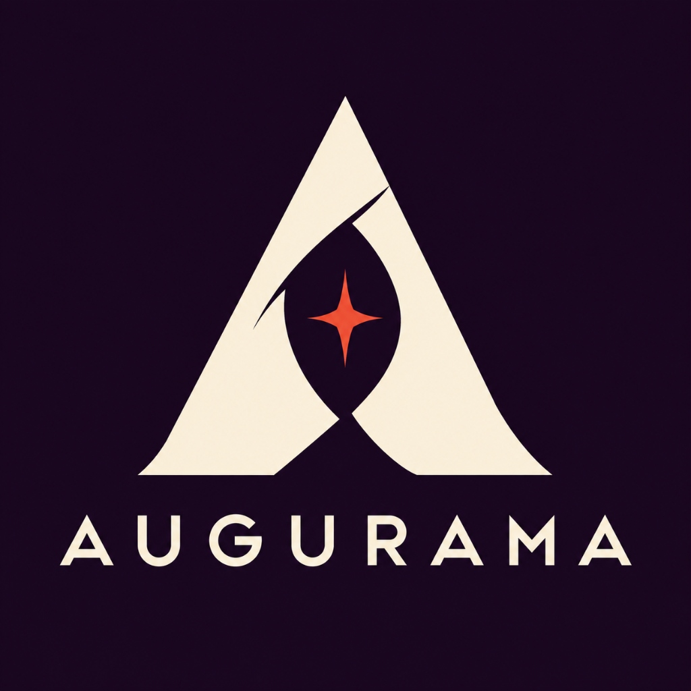

<div align="center">


# Augurama by Baba Hayden
**Autonomous Video Directing & Multimodal Storyboard Orchestration Engine**

*Direct the story. Orchestrate the take. Powered by fal.ai.*

[](#verification)
[](#requirements)
[](#supported-frontier-models)
[](#antigravity-plugin-installation)
[](#license)

</div>

---

## 1. Overview

**Augurama by Baba Hayden** is a modular video directing engine and AI agent plugin designed for precision cinematography, multimodal storyboarding, and deterministic model orchestration. 

Instead of guessing raw text-to-video prompts or burning expensive generation credits on blind takes, Augurama acts as an autonomous virtual director:
1. **Authors & Compiles Intent**: Translates high-level natural language into camera motions (dolly, truck, pan, crane, zoom), shot pacing, sound design, and character continuity.
2. **Binds Immutable References**: Pins character likenesses, environments, and style assets with deterministic token mapping.
3. **Free Contract Preparation**: Freezes exact prompts, model parameters, recipe revisions, and transparent list-rate usage estimates into an immutable, cryptographic contract.
4. **Human-in-the-Loop Approval Gate**: Paid generation requests *never* occur autonomously. One human approval nonce authorizes exactly one generation pass via fal.ai.
5. **Private Media Archival**: Succeeded takes and intermediate keyframes are securely ingested and archived to private storage with signed, short-lived playback URLs.

---

## 2. Supported Frontier Video Models

Augurama by Baba Hayden integrates a modular protocol adapter layer (`AuguramaModelProtocol`) routing through the **fal.ai queue API** (`FAL_KEY`):

| Model | Fal.ai Endpoint / Identifier | Cost Baseline | Key Capabilities & Strengths |
| :--- | :--- | :--- | :--- |
| **MiniMax H3 Max Turbo** | `minimax/h3-max-turbo` | **$0.025/s** (480p)<br>**$0.040/s** (768p)<br>**$0.080/s** (1080p) | ~1.6s generation latency, prompt expansion (`balanced`, `quality`), photorealism, on-screen typography. |
| **MiniMax H3 Max** | `minimax/h3-max` | **$0.025/s** (480p)<br>**$0.040/s** (768p)<br>**$0.080/s** (1080p) | Full-fidelity cinematic rendering with deep spatial consistency and native audio. |
| **Alibaba Wan 3.0** | `wan-3` / `fal-ai/wan-3/text-to-video` | **$0.050/s** (480p)<br>**$0.100/s** (720p)<br>**$0.180/s** (1080p) | Pre-render spatial reasoning ("Thinking" mode); multimodal conditioning up to 10 images, 5 clips, 5 audio tracks. |
| **Alibaba Wan 2.7** | `wan-2.7` / `fal-ai/wan/v2.7/text-to-video` | **$0.050/s** (480p)<br>**$0.100/s** (720p)<br>**$0.150/s** (1080p) | High-speed multimodal motion synthesis and frame-to-frame coherence. |
| **Kuaishou Kling V3 Turbo Pro** | `fal-ai/kling-video/v3/turbo/pro/text-to-video` | Flat **$0.140/s** (1080p) | Native multi-shot storyboard sequencing via `multi_prompt` (up to 6 distinct shots in a single 15s pass). |
| **Kuaishou Kling V2.6 Pro** | `fal-ai/kling-video/v2.6/pro/text-to-video` | Flat **$0.100/s** (1080p) | Proven cinematic motion dynamics with character tracking. |
| **ByteDance Seedance 2.0 / 2.5** | `bytedance/seedance-2.0/text-to-video` | Token-billed / ~$0.072–$0.155/s | 100% backward-compatible execution for existing project plans and omni-reference modes. |

---

## 3. Architecture & Protocol Design

### Modular Protocol Pattern (`contracts/AuguramaModelProtocol.ts`)

Every frontier model adapter implements the strict `AuguramaModelProtocol` specification:

```typescript
export interface AuguramaModelProtocol {
  modelId: string;
  displayName: string;
  supportsNativeAudio: boolean;
  maxDurationSeconds: number;
  supportedResolutions: string[];
  compilePayload(scene: AuguramaScene): Record<string, any>;
  estimateCost(durationSec: number, resolution: string): number;
  execute(payload: Record<string, any>): Promise<AuguramaGenerationResult>;
}
```

### Safety & Integrity Invariants
- **Zero Surprise Takes**: Planning is entirely free of model charges. No generative API call occurs until the human explicitly clicks "Approve & Generate".
- **One Provider Task Per Contract**: The server enforces a cryptographic fingerprint and single-use approval nonce. Duplicate clicks or network retries never submit redundant paid jobs.
- **Credential Isolation**: Your `FAL_KEY` is encrypted at rest using AES-256-GCM. Credentials are never echoed in tool responses, prompt histories, logs, or chat transcripts.

---

## 4. Quickstart

### Prerequisites
- Python 3.11+ (Python 3.13 tested)
- `ffmpeg` & `ffprobe` (for media validation and dimension inspection)
- A [fal.ai](https://fal.ai) account with `FAL_KEY`

### Installation

```sh
# Clone repository
git clone https://github.com/bohselecta/augurama.git
cd augurama

# Install dependencies using uv or pip
uv venv
uv pip install -e ".[test]"
```

### Starting the Production Desk

```sh
# Initialize encryption key and owner invitation
export AUGURAMA_ENV=development
export AUGURAMA_BASE_URL=http://127.0.0.1:8765
export FAL_KEY="your-fal-key-here"

# Verify local configuration
uv run augurama doctor

# Generate an owner invitation
uv run augurama invite --label "Studio Owner"

# Launch the server
uv run augurama serve --host 127.0.0.1 --port 8765
```

Open `http://127.0.0.1:8765`, choose **Create account**, enter your invitation code, and access the Augurama Production Desk.

---

## 5. Google Antigravity Plugin Installation

Augurama is distributed as a native Google Antigravity plugin package.

### Installation via Global Plugin Directory

```sh
# Build distribution archives
python3 scripts/package_releases.py --out dist

# Install to Antigravity global plugin directory
mkdir -p ~/.gemini/config/plugins/augurama
cp -R dist/antigravity-package/* ~/.gemini/config/plugins/augurama/
```

### Workspace Plugin Installation
Alternatively, copy `dist/antigravity-package` to `.agents/plugins/augurama` within your project repository.

### Directing from Antigravity Chat
With the Augurama backend running, you can activate the `/direct-video` skill directly in pair-programming:

```text
/direct-video of a cinematic realistic video of a giant corgi stampede. The corgis are cow-sized and feel as overwhelming as a dinosaur herd. Tiny people on horseback try to herd them, but they are completely dwarfed by the enormous corgi pack. Make it epic, funny, dusty, and full of momentum, with sweeping wide shots and low-angle tracking shots. No dialogue, only natural stampede and environment sound. 10 seconds long with MiniMax H3 Max Turbo.
```

The agent will:
1. Query `augurama_get_capabilities` to retrieve reviewed model profiles and limits.
2. Structure the scene into timed shot beats, camera motion vectors, and audio cues.
3. Call `augurama_prepare_generation` to render a frozen review card with an approximate cost.
4. Present the review card or secure review link for your one-click human approval.
5. Poll and archive the resulting video into your private library.

---

## 6. CLI Reference

Augurama includes a dedicated operator CLI:

```sh
augurama keygen               # Generate a secure 32-byte base64url encryption key
augurama invite --label "..." # Issue a single-use account invitation
augurama serve                # Run the HTTP/MCP backend service
augurama doctor               # Validate environment, cards, FFmpeg, and storage
augurama maintain             # Sweep expired contracts and unpinned temp media
augurama reset-password <user># Securely reset account credentials
augurama delete-account <user># Remove account and local assets after reconciling jobs
```

---

## 7. Verification & Tests

Augurama maintains a rigorous verification suite:

```sh
# Run full unit and integration suite (128 tests)
DD_TEST_CHROMIUM="/Applications/Google Chrome.app/Contents/MacOS/Google Chrome" uv run --extra test pytest

# Verify frontend JavaScript syntax
node --check src/augurama/web/app.js
node --check src/augurama/web/widget.js

# Build and validate release packages
python3 scripts/package_releases.py --out dist
```

All 128 tests pass across cryptography, OAuth PKCE, MCP tool contracts, video metadata inspection, Fal.ai queue integration, and offline browser harnesses.

---

## 8. License

Copyright © 2026 Corgi-Verse Software. All rights reserved.
Distributed under the Corgi-Verse Software Proprietary License. See `LICENSE` for details.
